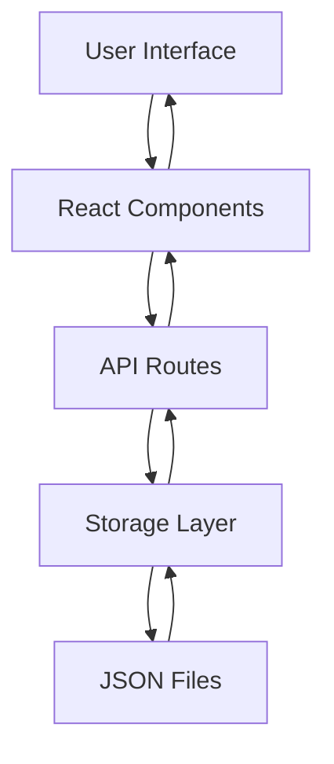

# Builder Tracker - System Architecture

## Overview

Builder Tracker is a lightweight web application designed for rapid prototyping and local development. The architecture prioritizes simplicity and speed over scalability for MVP validation.

## System Components

### Frontend Layer
- **Framework**: Next.js 15 with App Router
- **UI Library**: React 18 with TypeScript
- **Styling**: TailwindCSS for utility-first styling
- **State Management**: React hooks (useState, useEffect)
- **Routing**: Next.js file-based routing

### Data Layer
- **Storage**: Local JSON files in `/data` directory
- **Persistence**: Node.js fs.promises for file operations
- **Schema**: Simple JSON objects with timestamps and IDs

### API Layer
- **Routes**: Next.js API routes (`/api/habits`)
- **Methods**: RESTful GET/POST endpoints
- **Validation**: Basic input validation and error handling

## Data Flow



## File Structure

```
/
├── src/
│   ├── app/
│   │   ├── api/habits/          # API endpoints
│   │   ├── dashboard/           # Dashboard page
│   │   ├── layout.tsx           # Root layout
│   │   └── page.tsx             # Home page
│   ├── components/
│   │   ├── HabitForm.tsx        # Logging form
│   │   ├── HabitList.tsx        # Recent habits
│   │   └── SimpleCharts.tsx     # Data visualization
│   └── lib/
│       ├── types.ts             # TypeScript interfaces
│       └── storage.ts           # File operations
├── data/
│   └── habits.json              # Local data storage
└── docs/                        # Documentation
```

## Data Model

### HabitEntry Interface
```typescript
interface HabitEntry {
  id: string              // Timestamp-based unique ID
  project: string         // Project/task description
  duration: number        // Minutes spent
  productivity: number    // Rating 1-5
  notes?: string         // Optional notes
  date: string           // ISO date string
  createdAt: string      // ISO timestamp
}
```

### Storage Format
```json
{
  "entries": [
    {
      "id": "1751026360950",
      "project": "React Components",
      "duration": 90,
      "productivity": 4,
      "notes": "Built dashboard components",
      "date": "2025-06-27",
      "createdAt": "2025-06-27T12:12:40.950Z"
    }
  ]
}
```

## Security Considerations

### Current Implementation
- **Local-only**: No external network dependencies
- **No authentication**: Single-user local application
- **File permissions**: Standard OS file system permissions

### Production Considerations
- **Database encryption**: Encrypt sensitive data at rest
- **User authentication**: JWT or session-based auth
- **API security**: Rate limiting and input sanitization
- **HTTPS**: Secure transport layer

## Performance Characteristics

### Current Performance
- **Load time**: ~1-2 seconds for initial page load
- **Data operations**: Synchronous file I/O (acceptable for small datasets)
- **Memory usage**: Minimal, loads all data into memory
- **Scalability**: Suitable for 100s of entries, not 1000s

### Bottlenecks
- **File I/O**: Synchronous operations block the event loop
- **Memory**: All data loaded into memory on each request
- **Concurrency**: No locking mechanism for concurrent writes

## Evolution Path

### Phase 1: Current (MVP)
- Local JSON storage
- Single-user interface
- Basic analytics

### Phase 2: Enhanced Local
- SQLite database
- Data export/import
- Advanced filtering

### Phase 3: Multi-user
- PostgreSQL database
- User authentication
- Cloud deployment

### Phase 4: Production
- Microservices architecture
- Real-time sync
- Mobile applications
- Advanced analytics

## Technology Decisions

### Why Next.js?
- **Full-stack**: Frontend and API in one framework
- **TypeScript**: Built-in TypeScript support
- **Performance**: Automatic optimization and bundling
- **Developer Experience**: Hot reload and great tooling

### Why Local JSON?
- **Simplicity**: No database setup required
- **Privacy**: Data stays on user's machine
- **Speed**: Fast for prototyping and small datasets
- **Portability**: Easy to backup and transfer

### Why TailwindCSS?
- **Rapid development**: Utility-first approach
- **Consistency**: Design system built-in
- **Performance**: Purged CSS for production
- **Responsive**: Mobile-first design patterns

## Deployment Strategy

### Current: Local Development
```bash
npm install
npm run dev
# Visit http://localhost:3000
```

### Future: Production Deployment
- **Containerization**: Docker for consistent environments
- **Cloud hosting**: Vercel, Netlify, or AWS
- **Database**: Managed PostgreSQL (AWS RDS, Supabase)
- **CDN**: Static asset optimization
- **Monitoring**: Error tracking and performance monitoring
